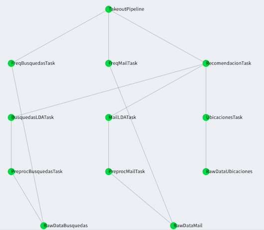

# Building a Recommender System

It is well known that developing, managing and improving a recommender system are not trivial tasks, and one of the reasons is because sometimes researchers are not able to assess the value and usefulness of any specific insights or even a dataset simply by examining the data themselves, special care is needed to ensure that methods and procedures are properly documented, or this information is available and accessible.[6]  

Replication is one of the main matter of this project's purpose, another goal is the improvement of models, even though evaluating Recommender Systems requires a definition of what constitutes a good system, and how this should be measured, and this is pretty complicated, maybe in further versions we will go deeper on this topic. Although is not going to be deprecated, that is why on this beta version, the user will help and contribute to improving with comments and bugs reports.  

If the data results in valuable insights, (or at least interesting), then they must not only be of good quality, they must be seen to be so. It is essential that methods are collected and compiled in line with agreed standards so that users are able to trust the data and are able to determine to the satisfaction that they are fit for their own purpose.  

Actually, the value of data is greatly increased if it can be compared with information from other sources, in this case, user's own knowledge, it is expected that they found the insights logical, in order to generate engagement.[7]  

So as it is been said so, is important to consider accuracy and satisfaction to get engagement, in fact, accuracy is the first factor that contributes to a good recommender, i.e. its capacity to satisfy the individual users information needs.[8].  

In other words, how well a recommender system performs this task is reflected by its accuracy: the more relevant, and the less irrelevant items it recommends, the more accurate it is, items that satisfy the information needs are “relevant” to the user. Following this path, the second factor that contributes to a good recommender system is its ability to provide “satisfaction” to the user.  At first glance, one may assume that an accurate recommender system, however, many additional factors influence user satisfaction.  


## Modular Application Framework

_Go Google Yourself!_ Is a web application created to be used for any kind of user who has a Google account, this application is built with a `R-Shiny` interface and a backend mounted in `Python`, everything works in a `AWS` cluster communicated and packaged in a `Docker Swarm` working with `AWS S3` buckets.  


Figure 10. User Interface Beta Version

Basically the Data Product it is based on 3 sources of information: Mails, Locations and Searches. The user interface has a `Browse` button where the user can upload a Takeoutfile, once the data is put on S3 buckets a Data Pipeline starts, first with a Pre-processing step, then an unsupervised density-based Machine Learning algorithm, is used to find clusters on a map, these clusters will be the most crowded places of the person, presumably: home, school, work, etc. all those places are going to be filtered by the important topics found it on Searches and Mails using Latent Dirichlet Algorithm. It is important to say that handling these important locations is the basis for showing (recommending) in the application the places of interest to, around those points with the help of the Google Maps API, the application has the option of being able to decide the time window in which it is desired to visualize.  

On the other hand, if a user has a Data Science approach is free to replicate the app locally. In a Github repository a researcher can expect a functional application with setup instructions. The user should be able to clone a repository and run a docker service. It is mandatory download your own Google Takeout files, then the user interface will give instructions for uploading the files, the user visualizes which are their more crowded places through the time and its recommendations.  

In order to make a short summary, what the application does is: load the files, read the files and upload to cloud, create location clusters, after that locate the most important ones, then filter sites of interest with keywords, finally, shows the places of interest to recommend, when the user log out the application destroys the user files.  


## The User Interface

### R-Shiny, Keep it Simple

For the development of the application it was used [Shiny](https://shiny.rstudio.com) as front-end, and the only prupose is visualize the output of the models and the descriptive data, to understand this, Shiny will only cares about how to get summary dataframes.

One important fact to notice here is that Shiny actually does not have any process "inside", in other words, if one wants to use a Shiny app to show the result of some study, normally the visualization tools and algorithms are run inside the app.  

Instead of, this modular framework, runs all the process and pipeline on Python, after that it sends the outputs to S3 buckets, and then Shiny is always "asking" S3 for the files, as we might see, there is no interaction between R-Shiny and Python algorithms, and all they work perfectly.  

Shiny is an open source R package that provides an elegant and powerful web framework for building web applications using R. Shiny helps out to turn the analyses into interactive web applications without requiring HTML, CSS, or JavaScript requirements.[9] For the sake of simplicity it is been chosed [Flask](http://flask.pocoo.org) as Back-end framework, to make everything work.  

On the other hand, Flask is called a micro framework because it does not require particular tools or libraries. It has no database abstraction layer for itself, form validation, or any other components. However, Flask supports extensions that can add application features as if they were implemented here is used to run the cluster and the database.[10]  

The main screen of every application is very significant for the sake of the user experience, that is why on the development is used [Shiny Dashboard](https://rstudio.github.io/shinydashboard/index.html), a beauty Shiny library that helps an intuitive navigation through the app options, from uploading the Google takeout file then the analysis results and finally the recommendations on the map.

### Google Maps API and Places Recommendation Algorithm

Google APIs is a set of application programming interfaces (APIs) developed by Google which allow communication with Google Services and their integration to other services. Examples of these include Search, Gmail, Translate or Google Maps. Third-party apps can use these APIs to take advantage of or extend the functionality of the existing services. For the development of this work we use the Google Places API Web Service.  

The Google Places API Web Service allows you to query for place information on a variety of categories, such as: establishments, prominent points of interest, geographic locations, and more. You can search for places either by proximity or a text string. A Place Search returns a list of places along with summary information about each place; additional information is available via a Place Details query.  

It is posible to restrict the results to places matching the specified type (around 90 types, for example: restaurant and library). The following example is a search request for places of type 'restaurant' within a 500m radius of a point in Sydney, Australia, containing the word 'cruise':

https://maps.googleapis.com/maps/api/place/nearbysearch/json?location=-33.8670522,151.1957362&radius=500&type=restaurant&keyword=cruise&key=YOUR_API_KEY

As it is been seen, taking advance of this kind of tools Google itself can help the joint of recommendation places, but first it is needed the topics found on the algorithm.  

The first step for this algorithm is to extract the keywords from searches and email records and obtain the most frequent locations. Then these keywords are classified in 90 possible categories. Finally, for each location, the google place API is used for place search specifying the categories previously obtained.  


## The Cloud and Back-end 

### Amazon Web Services

The application back-end implementation made use of two powerfull Amazon Web Services (AWS) tools, Amazon Simple Storage Service (S3) and Amazon Elastic Compute Cloud (EC2). The first, Amazon S3 known as storage for Internet, provides different interfaces REST, SOAP and BitTorrent that allow to store and obtain any amount of data, from anywhere on the web. Although S3 does not provide details on its design, clearly manages its data through an object storage arquitecture. This objects are organized into buckets. A bucket is a container used to store key/value pairs in S3 and can hold an unlimited amount of data so the user could potentially had just one bucket for all of his information.  
According to Amazon, this design aims at to provide scalability, high avalilability and low latency at commodity costs. [11] Amazon S3, also has implementations on different programming languages and third party connectors like Java, .NET, Python, PHP, Ruby, among others, that help on data migration to the cloud. Requests of resources are authorized using an Access Control List (ACL) associated with each bucket and object. The names and keys of the bucket must be unique and chosen so that the objects are addressable by HTTP URLs: [12]

* http://s3.amazonaws.com/bucket/key
* http://bucket.s3.amazonaws.com/key
* http://bucket/key (where bucket is a DNS CNAME record pointing to bucket.s3.amazonaws.com)

Amazon EC2, is a Infraestructure as a Service (IaaS), which provides the user a capability to rent by hour (hence the term "elastic") "instances" (i.e. virtual computers, which support different operative systems like Linux, FreeBSD and Microsoft Windows) on the cloud in a fast way, secure and with size or harware modifiable. Also, provides control of the geographical localtion of instances which allows optimization of the latency and the high redundancy level. [13]

### Merge the Pieces

The AWS tools mentioned above were combined with Luigi and Docker, with the aim of creating a modular, with high computing power, replicable and scalable architecture.

The first objective was achieved using Luigi, which is a Python module that helped us building complex pipelines of batch jobs. It handles dependency resolution, workflow management, visualization through a web interface, among other features. It also comes with Hadoop support built in. A pipeline is a set of data processing elements or tasks, in Luigi this tasks form a Directed Aciclic Graph (DAG), where the output of each task is the input of the next one, our DAG is displayed below. [14]


Figure 11. Overview of the pipeline executed on Luigi

A Luigi task has the following structure: 

```python
import luigi

class MyTask(luigi.Task):
	param =luigi.Parameter()
	def requires(self):
		return SomeOtherTask(self.param)
	def run(self):
		f = self.output.open('w')
		print >>f, "hello world!"
		f.close()
	def output(self):
		return luigi.LocalTarget('/tmp/foo/bar-%s'.format(self.param))

if __name__ == '__main__':
	luigi.run()
```

This tasks can execute obviously Python code, but also bash commands and with this the ability to run any programming language indirectly or even create a docker container inside a task, which gather all the requirements needed to run that task. Tasks are often executed in parallel or in time-sliced fashion. In our tasks we share data between them using Amazon S3, where we also update indicators that the front-end reads to update the pipeline overall state to display it to the user.  

A template to create a Luigi pipeline using Docker is based on [Adolfo de Unanue](https://github.com/nanounanue/pipeline-template. ) work.  

Docker was a key piece of our arquitecture because of its incredible replication solution and its philosopy related to the old Java promise of write once, run anywhere. In a technical definition, Docker is an open source engine that quickly wraps up any application and all its peculiar dependencies in a lightweight, portable, self-sufficient container that can run virtually anywhere on anybody's infrastructure. [15] Docker uses the resource isolation features of the Linux kernel such as cgroups and kernel namespaces, and a union-capable file system such as OverlayFS and others [16] to allow independent "containers" to run within a single Linux instance, avoiding the overhead of starting and maintaining virtual machines.[17]  

Taking this in consideration the last two objectives of our arquitectures were achieved using the tools Docker Engine and Docker Swarm. The latter, like its name states helped us build a swarm, this is a cluster of Docker engines, or nodes (related to a isolated virtual machine), where one can deploy services. The Docker Engine CLI and API include commands to manage swarm nodes (e.g., add or remove nodes), and deploy and orchestrate services across the swarm. [18]   

Each one of this nodes was an Amazon EC2 instance and on top of this nodes we setup a Docker swarm and deploy a Luigi server as a service, the latter was able to run as many Luigi workers as required. The swarm manager used its internal load balancing to distribute the Luigi tasks among services within the cluster, achieving with this high replication and scalability.  

The complete overview of the arquitecture can be observed on the image below, starting on the left side, the Amazon EC2 instances act as a base of our infraestructure on top of this instances different nodes support a Docker swarm, which is running a Luigi server service in charge of running Docker containers. This containers execute each one of the pipeline tasks related to the processing of mail, searches or locations.   


Figure 12. Back-end Pieces Merged

Amazon S3 do the storage part of every tasks, and also using indicators (objects with 0/1 values) report to the front-end the status about of each one of the pipeline tasks.  

## Further Than Beta Version

As part of the project itself is significat to notice which are the main areas to keep working, some ideas are: 

+ Integrate more google data applications

+ Improve ML algorithms

+ Formal testing for user expirience
